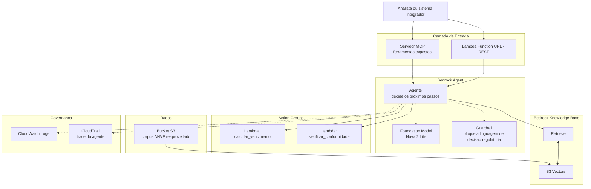

# Agente de Verificação de Conformidade Regulatória — Estudo de Caso

> **Capítulo 2** de uma série de estudos de caso sobre engenharia de produtos de IA corporativos. **Capítulo 1:** [case-ba-re-aws-genai](https://github.com/nilalisson14/case-ba-re-aws-genai) — RAG regulatório em AWS.

> **EN summary:** Requirements Engineering case study for an agentic AI system: a Bedrock Agent that verifies regulatory compliance (deadline rules, rectification dates) using deterministic tools (action groups), refuses to make regulatory decisions by configured guardrail (not just prompt instruction), and is exposed via the MCP protocol for interoperability with other AI clients. Built as a direct evolution of a gap identified and documented in Chapter 1.

**Status do projeto:** planejado, execução ainda não iniciada.

**Autor:** Nil Alisson A. Pereira — Analista de Requisitos / Engenheiro de Requisitos Sênior, em transição para AI Engineer
[LinkedIn](https://linkedin.com/in/nilalisson) · [Site](https://nilalisson.com.br) · [Capítulo 1 deste estudo](https://github.com/nilalisson14/case-ba-re-aws-genai)

---

## Por que este projeto existe

O Capítulo 1 provou que um sistema RAG responde perguntas citando a fonte certa, inclusive escolhendo a versão correta entre documentos que se contradizem. Mas ele tem um limite estrutural: não **verifica** nada sozinho, não **calcula** nada, e não teria como — o pipeline usado ali (`RetrieveAndGenerate`) é de um passo só.

Uma história de usuário do Capítulo 1 (comparação entre documentos) ficou marcada como "validada parcialmente" exatamente por isso. Este projeto resolve essa lacuna com a ferramenta certa: um agente que decide quais passos dar, não um pipeline fixo.

Especificação completa do problema, cenário de negócio, histórias de usuário e requisitos não funcionais em [`02-requirements/caso_de_uso.md`](02-requirements/caso_de_uso.md).

## Estrutura deste repositório

```
01-discovery/        problema de negocio, cenario, stakeholders
02-requirements/      historias de usuario, RNFs, regras de negocio, rastreabilidade
03-architecture/      diagrama de arquitetura, decisoes (ADR), contrato das ferramentas
04-ai-engineering/    codigo dos action groups, configuracao do guardrail, servidor MCP
05-evaluation/        dataset de teste, script de avaliacao, resultados
06-governance/        trilha de auditoria, riscos, conformidade
```

Cada pasta tem seu próprio README, focado na pergunta que aquela fase responde:

| Pasta | Pergunta que responde |
|---|---|
| `01-discovery` | Qual problema de negócio justifica este projeto? |
| `02-requirements` | O que o sistema precisa fazer, e como sei que ele fez certo? |
| `03-architecture` | Por que esta arquitetura, e não outra? |
| `04-ai-engineering` | Como cada peça foi implementada? |
| `05-evaluation` | Como medimos se funciona de verdade? |
| `06-governance` | Como auditamos e conferimos conformidade? |

## Arquitetura



Diferença chave em relação ao Capítulo 1: ali, uma pergunta gerava uma chamada de API e uma resposta. Aqui, o **Bedrock Agent** decide dinamicamente se busca na base de conhecimento, se chama uma ferramenta de cálculo, ou se recusa a responder por guardrail — antes de devolver qualquer coisa ao usuário.

## Reaproveitamento consciente

Este projeto reutiliza o corpus documental sintético (agência fictícia ANVF) e os aprendizados de infraestrutura do Capítulo 1 (S3 Vectors por custo, Titan Embeddings V2, região us-east-1). O que muda é a camada de orquestração acima da base de conhecimento. Isso é uma decisão deliberada: não recriar o que já está provado, para focar o esforço no que é genuinamente novo — Agent, action groups, guardrails, MCP.

## Roadmap de execução

Passo a passo completo, fase por fase, em [`roadmap/passo_a_passo.md`](roadmap/passo_a_passo.md) (a ser criado conforme a execução avança, seguindo o mesmo padrão de documentação do Capítulo 1: decisões registradas, bugs documentados com causa raiz, nada escondido).

## Sobre o autor

Analista de Requisitos / Engenheiro de Requisitos com 10 anos de atuação em ambientes institucionais regulados (ANVISA, Petrobras, SEFAZ-PB, SEE-PB), em transição documentada para AI Engineer. Mestrando em Ciência da Computação (UFPB), pesquisando LLMs aplicados à Engenharia de Requisitos.
